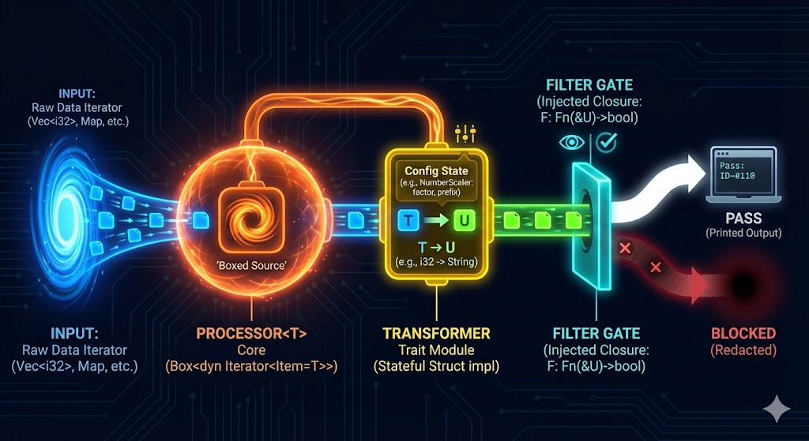
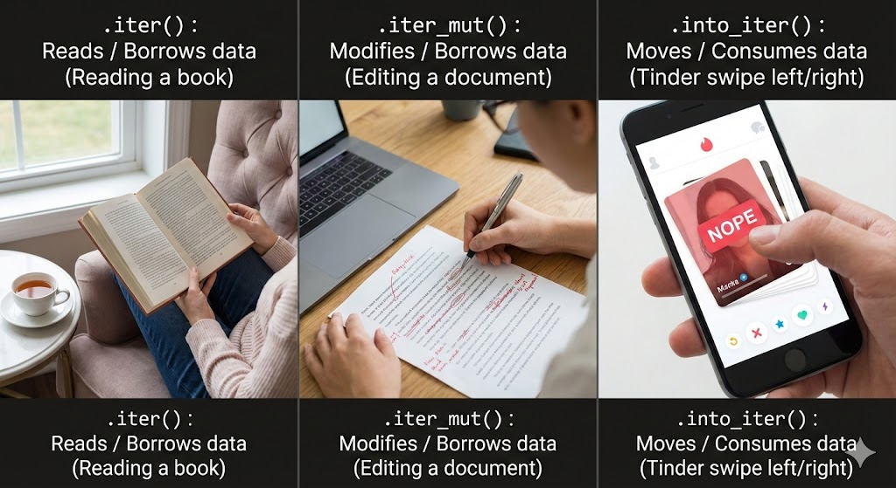

# Generic & Traits

## Generics \<T>

<figure><figcaption></figcaption></figure>

The main purpose of generics is to reduce code duplication. This allows us to use the same function signatures and behaviors for different concrete type parameters. One example is shown below:

```rust
// This defines a function largest generic over type T, 
// returning ref type T as output
fn largest<T>(list: &[T]) -> &T {
    let mut largest = list[0];
    for &item in list {
        if item > largest {
            largest = item;
        }
    }
    largest
}
```

This code block might already raise a few questions. We are passing a slice `&[T]` as our input, and accessing the elements via `list[0]`. If you are unfamiliar with borrowing rules, please refer to the excellent Rust docs at [References and Borrowing](https://doc.rust-lang.org/book/ch04-02-references-and-borrowing.html?highlight=borrow#references-and-borrowing).

However, the primary benefit of generics is creating reusable code blocks. This allows us to build something like this:

```rust
let number_list = vec![1, 2, 3, 4, 5]; // type i32
let char_list = vec!['a', 'b', 'c', 'd', 'e']; // type char

let largest_num = largest(&number_list);
let largest_char = largest(&char_list);
```

This saves us distinct time by allowing us to reuse functions without declaring concrete types in the first place.

***

## Inherent Implementation

<figure><figcaption></figcaption></figure>

Rust has a clear separation of type declaration (Data) and behavior declaration (Logic). It is impossible to declare functions inside a struct block like you would in a [Java class](https://www.w3schools.com/java/java_class_methods.asp).

Instead, we use an Inherent Implementation block. To declare functions for a generic struct, we must handle the syntax carefully:

```rust
// 1. The Data: Declare a generic struct SuperVec with type T
struct SuperVec<T> {
    list: Vec<T>,
    name: String,
}

// 2. The Behavior: Implement methods for SuperVec
// We must declare <T> after 'impl' so Rust knows T is a generic placeholder,
// not a concrete type like i32 or String.
impl<T> SuperVec<T> {
    
    // A 'constructor' method to create a new SuperVec
    fn new(name: String) -> Self {
        SuperVec {
            list: Vec::new(),
            name,
        }
    }

    // A method to add items to our list
    // We use &mut self because we are modifying the struct
    fn add_item(&mut self, item: T) {
        self.list.push(item);
    }
    
    // A method to get the length
    // We use &self because we are just reading data
    fn get_length(&self) -> usize {
        self.list.len()
    }
}
```

This allows us to have different behavior for the same struct with different data type for parameters:

```rust
// 1. The Data Structure
struct SuperVec<T> {
    list: Vec<T>,
    name: String,
}

// 2. Generic Implementation (Applies to ALL types)
// Note: We use <T> here because it works for any T
impl<T> SuperVec<T> {
    fn new(name: String, list: Vec<T>) -> Self {
        SuperVec {
            list,
            name,
        }
    }
}

// 3. Specific Implementation for Floats (f32)
// Note: We do NOT write impl<f32>. We just write impl SuperVec<f32>
impl SuperVec<f32> {
    fn largest(&self) -> f32 {
        let mut largest = self.list[0];
        
        // We use &self.list to borrow the vector
        for &i in &self.list {
            if i > largest {
                largest = i;
            }
        }
        largest
    }
}

// 4. Specific Implementation for Strings
// Note: String (owned) because &str cannot be modified easily
impl SuperVec<String> {
    fn add_suffix_and_create_new(&self, suffix: &str) -> Self {
        let mut new_list = Vec::new();
        
        // We iterate and create NEW strings
        for s in &self.list {
            let mut new_string = s.clone();
            new_string += suffix;
            new_list.push(new_string);
        }
        
        // Arguments must match the order in fn new(name, list)
        SuperVec::new("New SuperVec".to_string(), new_list)
    }
}
```

***

## Traits

<figure><figcaption></figcaption></figure>

In simpler terms, traits define shared behavior. They do not declare structs or objects, but rather shared behavior (function signatures) among several objects. The syntax is simple using the keyword `trait`:

```rust
// Any struct that implements 'Summary' MUST have a function
// called 'summarize' that returns a String.
pub trait Summary {
    fn summarize(&self) -> String;
}
```

Notice how `&self` is passed into here? It is actually passing an immutable reference of the object implementing this trait. Also, bear in mind that this only declares the function signature, not the implementation of the function. Hence, this is similar to how [abstract classes behave in Scala](https://docs.scala-lang.org/overviews/scala-book/abstract-classes.html).

To implement a trait's behavior on an object, we need the keyword `impl` and `for`  . We can have the same function signature that produces entirely different output, such as:

```rust
pub struct NewsArticle {
    pub headline: String,
    pub author: String,
    pub content: String,
}

// 1. Implementation for NewsArticle
// Logic: Returns "Headline by Author"
impl Summary for NewsArticle {
    fn summarize(&self) -> String {
        format!("{} by {}", self.headline, self.author)
    }
}

pub struct Tweet {
    pub username: String,
    pub content: String,
}

// 2. Implementation for Tweet
// Logic: Returns "username: content"
impl Summary for Tweet {
    fn summarize(&self) -> String {
        format!("{}: {}", self.username, self.content)
    }
}
```

The core idea is similar to [overriding in Java](https://www.geeksforgeeks.org/java/overriding-in-java/), which allows the same function signature to produce different logic on different structs via polymorphism.

***

## Trait Bounds

<figure><figcaption></figcaption></figure>

Trait bounds are used in function parameters to specify what trait has to be implemented by a specific type to be accepted. For example:

```rust
use std::fmt::Display;

struct Rectangle {
    length: f64,
    height: f64
}

trait HasArea {
    fn area(&self) -> f64;
}

impl HasArea for Rectangle {
    fn area(&self) -> f64 { self.length * self.height }
}

// for single trait bound, can be defined as &impl
fn calc_area(item: &impl HasArea) -> f64 { // same as <T: HasArea>(item: &T)
    item.area()
}

// T must have an area and printable (multiple bounds)
fn print_area_info<T: HasArea + Display>(item: &T) {
    println!("Item: {}", item); // Requires Display
    println!("Area: {}", item.area()); // Requires HasArea
}
```

For clarity, multiple trait bounds can be rewritten as:

```rust
fn print_area_info<T>(item: &T) where T: HasArea + Display {
    println!("Item: {}", item); // Requires Display
    println!("Area: {}", item.area()); // Requires HasArea
}
```

In addition, trait bounds are crucial for determining which generic types can be compared using the `PartialOrd` trait. In the code block below, the bound acts as a filter: it automatically accepts any type that implements both `Display` and `PartialOrd`, without us needing to write specific implementations for each data type.

```rust
use std::fmt::Display;
use std::cmp::PartialOrd;

// 1. Define a generic struct to hold the items
struct Pair<T> {
    x: T,
    y: T,
}

// 2. Standard implementation (available for ALL types)
impl<T> Pair<T> {
    fn new(x: T, y: T) -> Self {
        Self { x, y }
    }
}

// 3. Conditional Implementation (The Deep Dive)
// This block ONLY applies if T can be compared AND printed.
// If T doesn't support this, the method 'print_winner' simply doesn't exist!
impl<T> Pair<T> 
where 
    T: Display + PartialOrd  // -> implementing a trait on a generic struct
{
    fn print_winner(&self) {
        if self.x >= self.y {
            println!("The winner is x: {}", self.x);
        } else {
            println!("The winner is y: {}", self.y);
        }
    }
}

fn main() {
    // Case A: Integers (Implement Display + PartialOrd) -> WORKS
    let p1 = Pair::new(10, 20);  //number implements partial order
    p1.print_winner(); 

    // Case B: Vectors (Do NOT implement Display) -> COMPILE ERROR
    let p2 = Pair::new(vec![1], vec![2]); // vector does not
    // p2.print_winner(); // Error: method not found because Vec<i32> is not Display!
}
```

***

## Generic Traits

<figure><figcaption></figcaption></figure>

Imagine if Generics and Traits had a baby; the result is a powerful concept known as Generic Traits. This is a culmination of everything we have learned so far, so make sure you have a solid grasp of the previous concepts before diving in.

A generic trait is simply a trait that accepts generic parameters. This allows you to implement the same trait multiple times for the same object, but with different input types.

```rust
trait Something<T> {
    fn do_smth(self, smth: T) {};
}
```

For example, we can do:

```rust
// A Generic Trait
// The <T> allows us to define what TYPE of thing we are printing
trait Printer<T> {
    fn print(&self, item: T);
}

// A simple concrete struct
struct Console;

// 1. Implement Printer for Numbers (f32)
impl Printer<f32> for Console {
    fn print(&self, item: f32) {
        println!("Printing number: {:.1}", item);
    }
}

// 2. Implement Printer for Strings
// We use the EXACT same trait, but now it accepts a String!
impl Printer<String> for Console {
    fn print(&self, item: String) {
        println!("Printing string: {}", item.to_uppercase());
    }
}

fn main() {
    let c = Console;
    c.print(42.5);           // Calls the f32 version
    c.print("Hello".to_string()); // Calls the String version
}
```

***

## Generic Structs + Box\<dyn>

<figure><figcaption></figcaption></figure>

While generic structs are powerful, sometimes they are too rigid. Rust requires generic types to have a known size at compile time. But what if we want to store a complex iterator (like a `.map().filter()`) where the type is impossible to write out?

To tackle this, we can use a Trait Object wrapped in a `Box`. This moves the data to the heap, allowing us to store "something that acts like an Iterator" without knowing exactly what it is.

```rust
struct DataStream<T> {
    // 'dyn' means Dynamic. 
    // We don't know the exact type of the iterator, just that it yields T.
    source: Box<dyn Iterator<Item = T>>,
}
```

With this design, we can introduce an implementation for our generic struct. If you recall, this is an inherent implementation, which means we are defining methods directly on the struct without needing a trait declaration.

The `'static` keyword here is used to satisfy Rust's lifetime rules. Since `Box` owns the data on the heap, Rust needs a guarantee that the iterator we put inside doesn't contain any temporary references that might expire (dangle) while the `Box` is still using them.

Note: If we omit `'static`, the code will fail to compile. Rust prevents us from accidentally storing temporary data in a long-lived container.

```rust
impl<T> DataStream<T> {
    // I: The input type must be an Iterator yielding T.
    // 'static: The iterator must not contain references that might expire.
    fn new<I>(input: I) -> Self 
    where I: Iterator<Item = T> + 'static 
    {
        DataStream {
            source: Box::new(input) // Move the iterator to the Heap
        }
    }
    fn next_item(&mut self) -> Option<T> {
        self.source.next()
    }
}
```

***

## The Final Boss

To conclude this chapter, let's analyze a code example that intertwines every concept we have learned: Generic Structs, Generic Traits, Trait Objects (`Box`), Complex Bounds (`where`), and additional mention for Closures (`Fn`).

This represents the architecture of a high-performance data pipeline.

<figure><figcaption></figcaption></figure>

```rust
use std::fmt::Display;

// A trait that takes in two generic types, T, U
trait Transformer<T, U> {
    fn transform(&self, input: T) -> U;
}

// A struct that implements dynamic Box
struct Processor<T> {
    source: Box<dyn Iterator<Item = T>>,
}

// Implementation for struct Processor
impl<T> Processor<T> {
    fn new<I>(iter: I) -> Self 
    where 
    // 'static to obey lifetime rules
        I: Iterator<Item = T> + 'static 
    {
        Processor { source: Box::new(iter) }
    }
    // four generic types which enforces trait bounds
    fn process_and_print<U, M, F>(&mut self, trans: &M, filter: F)
    where
        T: Display,          
        U: Display + PartialOrd, 
        M: Transformer<T, U>,
        // For functions, Fn is a trait where the input and output can be declared
        F: Fn(&U) -> bool, 
    {        
        while let Some(input) = self.source.next() {
            // Step A: Transform (using Trait)
            let output = trans.transform(input); // T becomes U
            
            // Step B: Filter (using Injected Function)
            if filter(&output) {
                // If it passes the filter, we print it
                println!("Pass: {}", output);
            } else {
                println!("Blocked: [Redacted]");
            }
        }
    }
}

// A concrete struct that will act as our Transformer
struct NumberScaler {
    factor: i32,
    prefix: String,
}

// Implementing the Generic Trait
// It uses its internal state (factor/prefix) to transform T -> U
impl Transformer<i32, String> for NumberScaler {
    fn transform(&self, input: i32) -> String {
        format!("{}{}", self.prefix, input * self.factor)
    }
}

fn main() {
    // 1. Create a complex iterator (Map)
    let complex_iter = vec![1, 5, 2, 8].into_iter().map(|x| x + 1);

    // 2. Box it into our Processor
    let mut processor = Processor::new(complex_iter);

    // 3. Create our Logic Unit (With State!)
    // We configure it to multiply by 10 and add "ID-#"
    let scaler = NumberScaler { 
        factor: 10, 
        prefix: "ID-#".to_string() 
    };

    // 4. Run the Pipeline
    processor.process_and_print(
        &scaler,         // The stateful transformer
        |s| s.len() > 5  // The injected filter logic
    );
}
```

Let's try disintegrating the concepts one by one.

First, we define the rules of engagement. `Transformer<T, U>` is a generic trait that accepts two types. This allows us to define flexible logic that can convert _any_ input `T` into _any_ output `U`.

Next, we build the engine. `Processor<T>` uses a Trait Object (`Box<dyn Iterator>`) to store the data source. This is crucial because iterators in Rust often have complex, unnameable types (like `Map<Filter<Vec...>>`). By boxing it, we erase that complexity and just treat it as "something that iterates."

```rust
// A trait that takes in two generic types, T, U
trait Transformer<T, U> {
    fn transform(&self, input: T) -> U;
}

// A struct that implements dynamic Box of type iterator
struct Processor<T> {
    source: Box<dyn Iterator<Item = T>>,
}
```

In the implementation block, we use two advanced techniques:

* `'static` Lifetime: In `fn new`, we require the iterator to be `'static`. This is a safety guarantee that the iterator owns its resources and won't point to data that might disappear while the `Processor` is using it.
* Trait Bounds: The `process_and_print` function is where the magic happens. It coordinates four different generic types (`T`, `U`, `M`, `F`) using a `where` clause to ensure they all work together.

Notice specifically `F: Fn(&U) -> bool`. This treats a function as a generic type, allowing us to pass in a closure (like `|s| s.len() > 5`) as if it were a normal variable.

```rust
// Implementation for struct Processor
impl<T> Processor<T> {
    fn new<I>(iter: I) -> Self 
    where 
    // 'static to obey lifetime rules
        I: Iterator<Item = T> + 'static 
    {
        Processor { source: Box::new(iter) }
    }
    // four generic types which enforces trait bounds
    fn process_and_print<U, M, F>(&mut self, trans: &M, filter: F)
    where
        T: Display,          
        U: Display + PartialOrd, 
        M: Transformer<T, U>,
        // For functions, Fn is a trait where the input and output can be declared
        F: Fn(&U) -> bool, 
    {        
        while let Some(input) = self.source.next() {
            // Step A: Transform (using Trait)
            let output = trans.transform(input); // T becomes U
            
            // Step B: Filter (using Injected Function)
            if filter(&output) {
                // If it passes the filter, we print it
                println!("Pass: {}", output);
            } else {
                println!("Blocked: [Redacted]");
            }
        }
    }
}
```

Finally, we implement `Transformer` for a concrete struct `NumberScaler`. Here we passes in a stateful transformer and use it to produce output according to the intended prefix and factor.

```rust
// A concrete struct that will act as our Transformer
struct NumberScaler {
    factor: i32,
    prefix: String,
}

// Implementing the Generic Trait
// It uses its internal state (factor/prefix) to transform T -> U
impl Transformer<i32, String> for NumberScaler {
    fn transform(&self, input: i32) -> String {
        format!("{}{}", self.prefix, input * self.factor)
    }
}

fn main() {
    // 1. Create a complex iterator (Map)
    let complex_iter = vec![1, 5, 2, 8].into_iter().map(|x| x + 1);

    // 2. Box it into our Processor
    let mut processor = Processor::new(complex_iter);

    // 3. Create our Logic Unit (With State!)   
    let scaler_x10 = NumberScaler { factor: 10, prefix: "ID-".to_string() };
    let scaler_x50 = NumberScaler { factor: 50, prefix: "SUPER-".to_string() };

    // We can pass different configurations to the same processor!
    processor.process_and_print(&scaler_x10, |s| s.len() > 5);
    // or
    processor.process_and_print(&scaler_x50, |s| s.len() > 5);
}
```

***

## Conclusion

Congratulations! If you have made it this far and understood the "Final Boss" example, you have accomplished something significant. You have crossed the threshold from writing Rust scripts to designing Rust systems.

This guide is  my first attempt at documenting these complex topics. I hope it has helped demystify the syntax and logic behind Rust's type system.

<figure><figcaption></figcaption></figure>

#### The Recap: What We Achieved

Throughout this chapter, we moved from rigid, specific code to flexible, reusable architecture:

* Generics (`<T>`): Allowed us to write logic once and apply it to any data type (Numbers, Chars, Custom Structs), reducing code duplication.
* Traits (`impl Trait`): Allowed us to define shared behavior (like "Printable" or "Comparable") instead of worrying about specific types.
* Trait Bounds (`where`): Gave us the power to enforce rules, ensuring our generic functions only accept types that can actually do the job.
* Trait Objects (`Box<dyn>`): Allowed us to break free from compile-time rigidity and handle dynamic data at runtime through type erasure.

#### Why This Matters

Generics and Traits are not just features to save you a few keystrokes; they are the vocabulary of Rust's design philosophy.

When you look at the source code of production-grade libraries (like `Tokio`, `Serde`, or the standard library), you won't see many functions taking simple `i32` or `String` arguments. Instead, you will see endless `T`, `U`, and `where` clauses. However, the design of separating the data (Struct), the rules (Traits), and the logic (Functions) is exactly what makes Rust so scalable and powerful.
